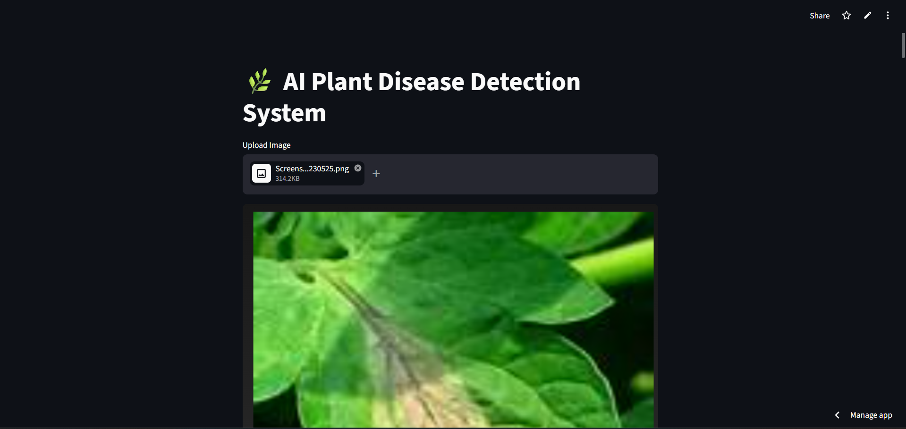
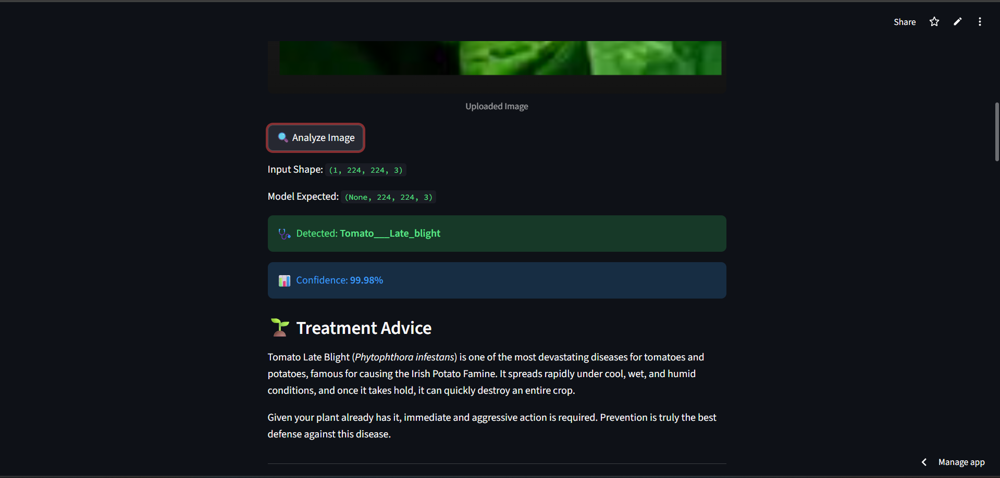

# 🌱 Jaaniv Krushi: AI Crop Disease Detection System

An **AI-powered agricultural diagnostic tool** that utilizes deep learning to classify plant diseases from the PlantVillage dataset and leverages Google's Gemini AI to provide actionable treatment and prevention strategies.

---

## 💡 Problem Statement
Farmers frequently lack immediate access to agricultural experts to identify crop diseases, leading to reduced yields. **Jaaniv Krushi** bridges this gap by combining computer vision for real-time disease detection with generative AI to offer instant, localized, and organic treatment plans.

---

## 🚀 Key Features & Architecture
**Data Flow:** `Leaf Image Input` ➔ `Image Preprocessing` ➔ `Keras CNN Inference` ➔ `Disease Classification` ➔ `Gemini AI Prompting` ➔ `Streamlit UI`

* **Deep Learning Vision:** Accurate image classification powered by a custom-trained Keras model.
* **Generative AI Advice:** Integrates Google Gemini API to generate context-aware treatment steps and organic solutions.
* **Interactive Dashboard:** A clean, user-friendly interface built entirely in Streamlit.
* **Jupyter Research Environment:** Includes full model training, data processing, and inference research in `Code.ipynb`.

---

## 📸 System Previews

### Disease Detection & Accuracy

### Treatment Steps

### Prevention Methods

### Organic Solutions

---

## 🛠️ Tech Stack
**Language:** Python 3.12+  
**Machine Learning:** TensorFlow, Keras, NumPy, PIL  
**Generative AI:** Google Gemini AI API  
**Frontend & Deployment:** Streamlit  
**Environment:** Jupyter Notebook, Windows PowerShell  

---

## ⚙️ Local Setup & Run (Windows PowerShell)

It is recommended to run this project in a virtual environment. All terminal commands are combined below for easy setup.

powershell
# 1. Clone the repository and navigate into it
git clone [https://github.com/your-username/jaaniv-krushi.git](https://github.com/AaradhyaNikam/jaaniv-krushi.git)
cd jaaniv-krushi

# 2. Create and activate a virtual environment
python -m venv .venv
.\.venv\Scripts\Activate.ps1

# 3. Upgrade pip and install dependencies
python -m pip install --upgrade pip
pip install -r requirements.txt

# 4. Launch the Web Application
streamlit run app.py
---
Aaradhya Aashish Nikam 2nd-Year B.Tech Student, D.Y. Patil Engineering College, Pune * LinkedIn: www.linkedin.com/in/aaradhya-nikam-02a69b32a

Email: nikamaaradhya97@gmail.com
